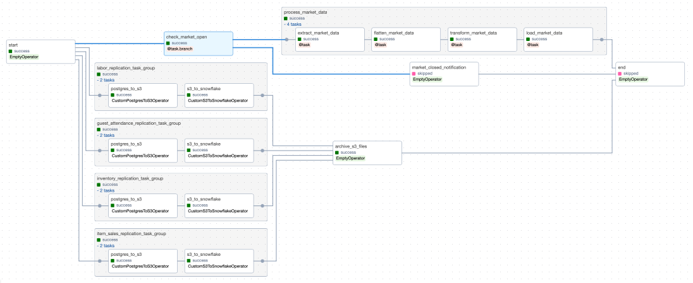

# Astronomer Field Engineer Panel Interview: Jake Roach

Welcome! This repo contains all the materials prepared for the Astronomer Field Engineer Panel Interview, for Jake 
 Roach. Three DAGs were written, each meeting the requirements outlined in the 
 `Astronomer Field Engineering Exercise.pdf` file in the `documentation/` directory of this repository. These DAGs were 
 tested in a local, development Airflow environment created used the Astro CLI. For more details about the development 
 and testing process, please see the respective **Environment Creation**, **Development**, and **Testing** sections 
 below. A high-level overview of the entire process and obstacles encountered are also detailed below. Please feel free 
 to reach out to Jake Roach via email (jroachgolf84@outlook.com) with any questions about the contents of this 
 repository.

## Table of Contents
1. [Overview](#overview)
2. [Environment Creation](#environment-creation)
3. [Development](#development)
   1. [Market ETL Data Pipeline](#market-etl-dag)
   2. [Daily Operational Data Pipeline](#daily-operational-dag)
   3. [Advanced Daily Dashboard Refresh Data Pipeline](#advanced-daily-dashboard-refresh-dag)
4. [Testing](#testing)
   1. [Using the Astro CLI](#using-the-astro-cli)
   2. [Unit Testing](#unit-testing)
   3. [End-to-end Testing](#end-to-end-testing)
5. [Obstacles](#obstacles)

## Overview
While this project was prepared for the Astronomer Field Engineer Panel Interview, an alternate scenario was created as
 a part of this exercise. This scenario is best summarized with the statement below:

> You have a data team manually building and running data pipelines, creating analyses, and developing models, but you
 don't have a tool to centrally maange all of these moving parts.

To better show how Airflow could help solve this problem, and provide a centralized tool to develop, deploy, and 
 maintain data pipelines, four pipelines where developed, as outlined in the **Development** section below. These DAGs
 illustrate how common data workflows can be created as Airflow DAGs using the Astro CLI and the Airflow framework.
 This `README.md` is more technical in nature, and complements the presentation to be used during the Panel Interview,
 which is available in the `documentation/` directory. Happy reading!

## Environment Creation

To create an Astro project, the Astro CLI is the *best* tool to use. This was already installed on  my local machine, 
 which I validated with the following command:

```commandline
> astro version
```

Within the root of this repository (`astronomer-panel-interview`), I initialized an Astro project with the command 
 below. I'm using the latest version of the Astro Runtime (9.5.0), which I specified in the command.

```commandline
> astro dev init --runtime-version 9.5.0
```
The appropriate files were created at the root of this repository, and I validated that my Astro project could be run
 (locally) by running the command `astro dev start`. After about a minute, my default web browser opened to 
 `localhost:8080`, and I was able to log into the Airflow UI. Success!

Update: After each of the four DAGs outlined in the requirements were written and tested, the example DAG artifacts were removed
 from this repository. There were a few places that needed to be cleaned up; both in the `dags/` directory, as well as in 
 the `tests/` directory.

## Development

### Market ETL DAG
The first DAG that I built was a basic ETL pipeline which  market data from the Polygon API, flattened the JSON that was
 returned in the response, transformed the flattened data, and loaded the data to a Postgres database. First, this DAG 
 was implemented using "traditional" Airflow operators, and then later, with the TaskFlow API. To configure the API key 
 that I'd be using to pull data from the Polygon API, I ran the following command: 

```commandline
> astro dev run variables set POLYGON_API_KEY *****
```

To create a Postgres connection, I ran the following:

```commandline
> astro dev run connections add \
    --conn-type postgres \
    --conn-host jroachgolf84-sandbox-postgres.ciz3ssohle2n.us-east-1.rds.amazonaws.com \
    --conn-login jroachgolf84 \
    --conn-password '*****' \
    --conn-port 5432 \
    --conn-schema postgres \
    postgres_market_conn
```

The table was initially created with the command below. This allowed for idempotency to be built into the pipeline (the
 `DELETE` command before the DataFrame is appended to the table each run). See below:

``` {sql}
CREATE TABLE market.transformed_market_data (
	market_date TEXT,
	ticker TEXT,
	open_price FLOAT,
	high_price FLOAT,
	low_price FLOAT,
	close_price FLOAT,
	change FLOAT,
	volume FLOAT
);
```

When refactoring the DAG to use the TaskFlow API, I wanted to make sure the DAG definition was verbose, but also,
 not cluttered. To do this, I only defined one task within the DAG definition, and the rest were defined in the
 `include/market_etl__taskflow_api__helpers.py` file. This gives the reader (or reviewer) a taste of the possibilities
 that the TaskFlow API offers.

### Daily Operational DAG
In addition to running tasks sequentially, Airflow can run tasks in parallel. In the `daily_opeartional_view_update` 
 DAG, four SQL queries are run, server-side in parallel, all orchestrated by Airflow. Without an orchestration tool like
 Airflow, Data Engineers would be left to schedule, run, and troubleshoot these pipelines in another manner.

What's great about the `PostgresOperator` (which was used to `CREATE OR REPLACE` a number of views in this DAG) is the 
 ease of connecting to a Postgres database, and the ability to pass in templated fields to the queries. Just by passing 
 a string with the name of the connection configured using the Astro CLI (or UI), a connection is made to the Postgres 
 database in a secure fashion. Since the value passed to the `sql` parameter is templated, all the fields referenced at 
 this link (https://airflow.apache.org/docs/apache-airflow/stable/templates-ref.html) can be used within the SQL query. 
 For more complex queries, a path to a `.sql` file can be passed to the `sql` parameter, making DAG definitions cleaner, 
 and easier to troubleshoot. To customize where these `.sql` files are stored within the project, the a path can be 
 passed to the `template_searchpath` parameter in the DAG definition. In this DAG, the following was added to the DAG
 definition:

```python
...
template_searchpath="include/sql",
...
```

Adding this to the DAG definition allowed for file names in the `include/sql` directory to be passed to the `sql` 
 parameter of the `PostgresOperator`, executing the query in the file when the DAG was run.

Note, a new Postgres connection was created, with name `postgres_daily_operational_conn`. This was done in a similar 
 manner as before (using the Astro CLI), but a different name was used, to ensure verbosity.

### Advanced Daily Dashboard Refresh DAG
Sometimes, operational dashboards rely on a dataset that needs to be regularly refreshed. What's the best tool to do 
 this with? Airflow! Here, the `advanced_daily_dashboard_refresh` DAG pulls data from disparate sources, and transforms,
 persists, and loads the data as needed. After this DAG finishes running (daily), a tool like Tableau, Looker, or Power 
 BI connected to the resulting data sources will have the most up-to-date data to populate graphics and other metrics. 
 This is a truly powerful use-case for Airflow, and can provide immediate value not only to Data Teams, but the 
 stakeholders these tools are built for. Below, you'll find a more in-depth description of what this DAG does, and how 
 it was built.

Some of the logic from the DAGs built before were used to build this more complex DAG. The `@task.branch()` decorator 
 was used to determine whether to trigger a market data workflow, or to notify the downstream stakeholder that the 
 market was closed. If the market was opened, a task group defined using the TaskFlow API was invoked, extracting,
 flattening, transforming, and loading the data, similar to what was done in the `market_etl__taskflow_api` DAG. To 
 define this task group using the TaskFlow API, the following code was written:

```python
...

    @task_group(group_id="process_market_data")
    def process_market_data():
        # Use previously defined tasks for market work (using the TaskFlow API)
        raw_data = extract_market_data()
        flattened_data = flatten_market_data(raw_data)
        transformed_data = transform_market_data(flattened_data)
        load_market_data(transformed_data)

...
```

In parallel, four task groups were created using the more traditional`with TaskGroup(...)` to move data from Postgres to 
 S3, before also moving this data to Snowflake. These task groups were dynamically-generated using a list of 
 dictionaries defined in the `include/advanced_daily_dashboard_refresh__helpers.py` file. Within each of these task 
 groups, two custom operators were instantiated. These were the `CustomPostgresToS3Operator`, and the 
 `CustomS3ToSnowflake` operator. These were built in the `plugins/` directory, and inherited from the `BaseOperator`. 
 These custom operators where somewhat transient, and only printed the actions that would be performed. The ability to 
 build custom operators illustrate the extensibility of Airflow, and it's ability to streamline the data pipeline 
 development process via re-usability. 

After the data was persisted in S3 and moved into Snowflake, an `EmptyOperator` was used to simulate archiving the data
 previously moved to S3. For the entire graph view of the DAG, please see below:


  

## Testing
To thoroughly test the four DAGs built for the Panel Interview, a number of approaches were taken including testing 
 using the Astro CLI, unit-testing, and end-to-end testing of DAGs in the UI.

### Using the Astro CLI
Using the Astro CLI, it's easy to test DAGs (and individual tasks). There are two commands that are quite useful:

```commandline
> astro dev run dags test <dag-id> <execution-date>
```

```commandline
> astro dev run tasks test <dag-id> <task-id> <execution-date>
```

The first command runs the specified DAG end-to-end for the execution date that is passed. This is useful if you only
 want to run the DAG once, for a specific date. However, if you're interested in how your DAG will perform in a 
 production-like setting, check out the **End-to-end Testing** section below. In addition to testing an entire DAG run, 
 you can test individual tasks using the `astro dev run tasks test ...` command.

For more information about using the Astro CLI to test your project, please check out this link: 
 <https://docs.astronomer.io/learn/testing-airflow#the-astro-cli>
 

### Unit-testing
When developing any sort of data pipeline, adding unit-testing to your development and testing process helps to generate
 better results. The `tests/` directory in the root of the Airflow project is automatically created (with a sample file
 showing a few unit tests) when `astro dev init` is run. In a normal workflow, I like to create a unit tests for the 
 following:

- Each DAG definition
- Any helpers defined in the `include/` directory
- Any custom operators or other tools defined in the `plugins/` directory

With the Astro CLI, it's easy to execute any unit tests written with the `pytest` library. Using the command
 `astro dev pytest`, all tests in the `tests/` directory are executed. Running these unit tests not only helps you catch 
 errors during development, but will also make it easier to catch warnings or deprecations. For this project, I wrote 
 sample unit tests for the `market_etl__traditional` DAG, the helpers in the 
 `include/market_etl__traditional__helpers.py` file, and the `CustomS3ToSnowflakeOperator`.

### End-to-end Testing
After DAGs have been manually tested and unit-tested, it's important to test them end-to-end using the Airflow UI. To do
 this, just navigate to the Airflow UI, and turn on the toggle to start the DAG. The UI makes it easy to catch any 
 errors that pop-up, and ensure performance is as expected. For example, for the `advanced_daily_dashboard_refresh` DAG,
 I expected the `market_closed_notification` task to be triggered by the upstream `@task.branch` on weekends, and 
 Memorial Day. The Airflow made this easy to identify, and helped me validate performance. When initially developing, 
 using the UI and the "Logs" functionality helps when debugging.

## Obstacles
Throughout this process, there was one main obstacle I stumbled upon; a limited "data stack" with which to work with to
 develop my DAGs. It's different using Airflow for a project like this, versus developing in an enterprise-setting. I 
 ended up creating a free-tier Postgres RDS instance in my personal AWS account, and created custom operators to mock 
 interacting with S3 and Snowflake, all of which worked great for building this project and presentation.
